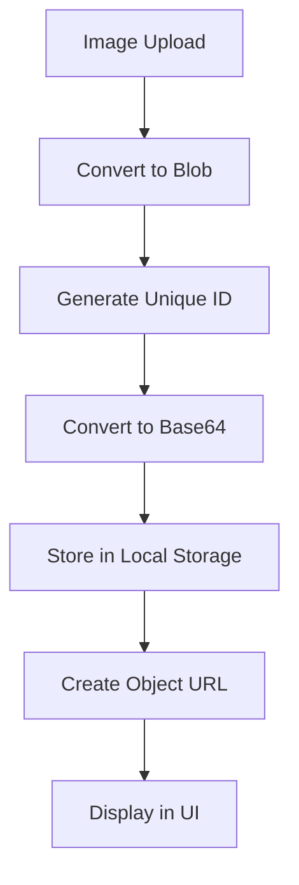
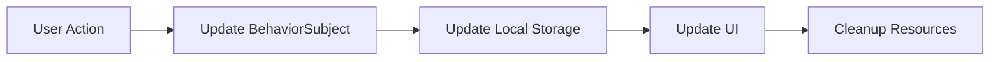
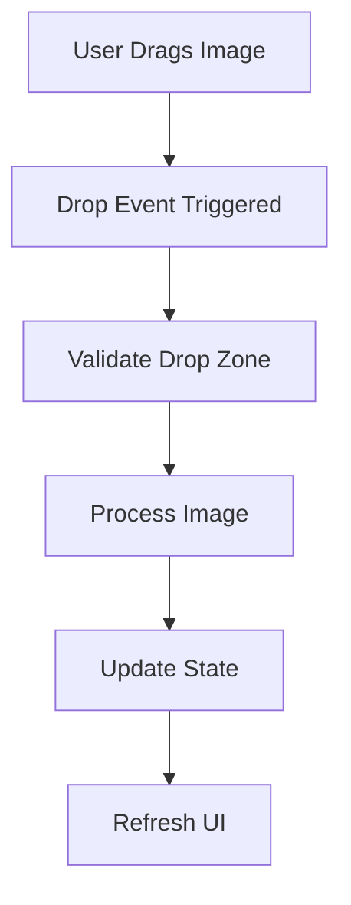
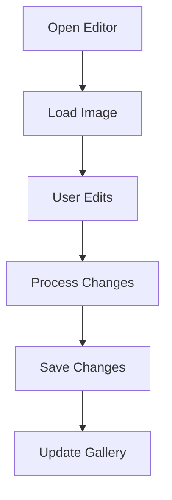

# Image Viewer Application Documentation

## Project Overview
The Image Viewer is a modern web application built with Angular that allows users to view, edit, and manage images with features like drag-and-drop functionality, image editing, and local storage management.

## Architecture

### 1. Technology Stack
- **Frontend Framework**: Angular 17 (Standalone Components)
- **UI Components**: Angular Material
- **State Management**: RxJS (BehaviorSubject)
- **Image Processing**: ngx-image-cropper
- **Storage**: Local Storage
- **Styling**: SCSS with Angular Material Design

### 2. Core Components
1. **Gallery Component**
   - Main interface for image display and management
   - Handles drag-and-drop functionality
   - Manages image selection and display

2. **Image Editor Component**
   - Provides image editing capabilities
   - Supports cropping and basic image manipulation
   - Handles image saving and updates

3. **Image Service**
   - Manages image data and storage operations
   - Handles image conversion and URL creation
   - Provides CRUD operations for images

## Data Flow

### 1. Image Storage

#### What is Blob?
A Blob (Binary Large Object) is a data type that represents binary data in the browser. In our application, we use Blobs to handle image data because:
- They can store large binary files efficiently
- They support various data types (images, files, etc.)
- They can be converted to URLs for display
- They work well with the File API

```typescript
// Blob Creation Process
const blob = new Blob([data], { type: 'image/jpeg' });
```

#### Storage Mechanisms

1. **Local Storage**
   - Browser-based key-value storage
   - Persistent across sessions
   - Limited to 5-10MB (varies by browser)
   - Synchronous operations
   ```typescript
   // Local Storage Operations
   localStorage.setItem('key', value);
   localStorage.getItem('key');
   ```

2. **Session Storage**
   - Similar to Local Storage but temporary
   - Cleared when browser session ends
   - Used for temporary image processing

3. **IndexedDB**
   - Larger storage capacity
   - Better for structured data
   - Asynchronous operations
   - Used for caching large images

4. **Memory Storage (Runtime)**
   - Temporary storage during application execution
   - Used for active image processing
   - Cleared when page refreshes

### 2. Storage Process Flow



1. **Image Upload Process**:
   ```typescript
   // 1. File Selection
   const file = event.target.files[0];
   
   // 2. Convert to Blob
   const blob = new Blob([file], { type: file.type });
   
   // 3. Generate ID
   const id = `${Date.now()}-${Math.random().toString(36).substr(2, 9)}`;
   
   // 4. Convert to Base64
   const reader = new FileReader();
   reader.readAsDataURL(blob);
   
   // 5. Store in Local Storage
   localStorage.setItem(`image_${id}`, base64String);
   
   // 6. Create Object URL
   const url = URL.createObjectURL(blob);
   ```

2. **Image Retrieval Process**:
   ```typescript
   // 1. Load from Local Storage
   const base64String = localStorage.getItem(`image_${id}`);
   
   // 2. Convert Base64 to Blob
   const byteCharacters = atob(base64String);
   const byteArrays = [];
   
   for (let offset = 0; offset < byteCharacters.length; offset += 512) {
     const slice = byteCharacters.slice(offset, offset + 512);
     const byteNumbers = new Array(slice.length);
     
     for (let i = 0; i < slice.length; i++) {
       byteNumbers[i] = slice.charCodeAt(i);
     }
     
     const byteArray = new Uint8Array(byteNumbers);
     byteArrays.push(byteArray);
   }
   
   const blob = new Blob(byteArrays, { type: 'image/jpeg' });
   
   // 3. Create Object URL
   const url = URL.createObjectURL(blob);
   ```

### 3. State Management Flow



1. **State Update Process**:
   ```typescript
   // 1. User performs action
   onImageUpdate(image: ImageData) {
     // 2. Update BehaviorSubject
     this.imagesSubject.next([...this.imagesSubject.value, image]);
     
     // 3. Update Local Storage
     this.saveToLocalStorage(this.imagesSubject.value);
     
     // 4. Update UI
     this.refreshGallery();
     
     // 5. Cleanup
     this.cleanupResources();
   }
   ```

2. **Resource Management**:
   ```typescript
   // Cleanup Process
   private cleanupResources() {
     // Revoke object URLs
     this.objectUrls.forEach(url => URL.revokeObjectURL(url));
     this.objectUrls.clear();
     
     // Clear temporary storage
     sessionStorage.clear();
     
     // Update memory cache
     this.updateCache();
   }
   ```

### 4. Feature Implementation Flow

#### Drag and Drop Process


1. **Drop Zone Configuration**:
   ```typescript
   // Drop Zone Setup
   <div class="drop-zone" 
        cdkDropList
        [cdkDropListData]="selectedImageArray"
        [cdkDropListConnectedTo]="[sideDropList]"
        (cdkDropListDropped)="onMainDrop($event)"
        (cdkDropListEntered)="onDropZoneEnter($event)"
        (cdkDropListExited)="onDropZoneExit($event)">
   ```

2. **Drop Event Processing**:
   ```typescript
   onMainDrop(event: CdkDragDrop<ImageData[]>) {
     // 1. Validate drop
     if (event.previousContainer === event.container) return;
     
     // 2. Get dragged image
     const draggedImage = event.previousContainer.data[event.previousIndex];
     
     // 3. Update state
     this.selectImage(draggedImage);
     
     // 4. Refresh UI
     this.refreshGallery();
   }
   ```

#### Image Editing Process


1. **Editor Opening**:
   ```typescript
   openEditor(image: ImageData) {
     // 1. Create dialog
     const dialogRef = this.dialog.open(ImageEditorComponent, {
       width: '90vw',
       data: { image }
     });
     
     // 2. Handle result
     dialogRef.afterClosed().subscribe(result => {
       if (result) {
         // 3. Process changes
         this.processImageChanges(result);
       }
     });
   }
   ```

2. **Change Processing**:
   ```typescript
   private processImageChanges(result: any) {
     // 1. Convert to Blob
     const blob = this.dataURLtoBlob(result.imageUrl);
     
     // 2. Update storage
     this.updateImage(result.id, blob);
     
     // 3. Refresh UI
     this.refreshGallery();
   }
   ```

## Feature Implementation

### 1. Drag and Drop
```typescript
// Drop Zone Configuration
<div class="drop-zone" 
     cdkDropList
     [cdkDropListData]="selectedImageArray"
     [cdkDropListConnectedTo]="[sideDropList]"
     (cdkDropListDropped)="onMainDrop($event)">
```

**Process Flow**:
1. User drags image to drop zone
2. `onMainDrop` event handler processes the drop
3. Image is selected and displayed in main view
4. State is updated through BehaviorSubject

### 2. Image Editing
```typescript
// Editor Opening Process
openEditor(image: ImageData) {
  const dialogRef = this.dialog.open(ImageEditorComponent, {
    width: '90vw',
    data: { image }
  });
}
```

**Process Flow**:
1. User clicks edit button
2. Editor dialog opens with image
3. User makes modifications
4. On save:
   - Image is processed
   - New version is saved
   - Gallery is updated
   - UI is refreshed

### 3. Image Management
```typescript
// Image Operations
saveNewImage(image: ImageData): Observable<ImageData>
updateImage(id: string, file: Blob): Observable<ImageData>
deleteImage(id: string): Observable<void>
```

**Process Flow**:
1. **Save New**:
   - Generate unique ID
   - Convert to base64
   - Store in Local Storage
   - Update gallery state

2. **Update**:
   - Find existing image
   - Update with new data
   - Refresh UI

3. **Delete**:
   - Remove from storage
   - Update gallery state
   - Clear selection if needed

## API Integration

### 1. Local Storage Operations
```typescript
// Storage Operations
private saveToLocalStorage(images: ImageData[]): void
private loadFromLocalStorage(): ImageData[]
```

**Process Flow**:
1. **Save**:
   - Convert images to storage format
   - Store in Local Storage
   - Handle errors

2. **Load**:
   - Retrieve from Local Storage
   - Convert to application format
   - Create object URLs

### 2. Image Processing
```typescript
// Image Processing
private createObjectURL(blob: Blob): string
private revokeObjectURL(url: string): void
```

**Process Flow**:
1. **URL Creation**:
   - Create object URL from Blob
   - Store URL for cleanup
   - Return URL for display

2. **Cleanup**:
   - Revoke object URLs
   - Prevent memory leaks
   - Handle component destruction

## User Interface

### 1. Layout Structure
- Main grid for selected image
- Side panel for image gallery
- Drop zones for drag and drop
- Overlay controls for actions

### 2. Responsive Design
- Flexible grid system
- Adaptive image sizing
- Mobile-friendly interface
- Touch-friendly controls

### 3. Visual Feedback
- Drag and drop indicators
- Selection highlights
- Loading states
- Error notifications

## Error Handling

### 1. Storage Errors
- Handle Local Storage limits
- Manage failed operations
- Provide user feedback

### 2. Image Processing Errors
- Handle invalid images
- Manage failed conversions
- Clean up resources

### 3. State Management Errors
- Handle invalid states
- Provide recovery options
- Maintain data consistency

## Performance Considerations

### 1. Image Optimization
- Lazy loading
- URL management
- Memory cleanup

### 2. State Updates
- Efficient updates
- Minimal re-renders
- Resource management

### 3. Storage Management
- Efficient storage
- Cleanup routines
- Memory management

## Future Enhancements
1. Cloud storage integration
2. Advanced image editing
3. Batch operations
4. Sharing capabilities
5. User preferences
6. Image compression
7. Offline support
8. Collaborative features

## Conclusion
The Image Viewer application demonstrates modern web development practices with Angular, providing a robust and user-friendly interface for image management. The architecture ensures scalability, maintainability, and performance while delivering a smooth user experience. 